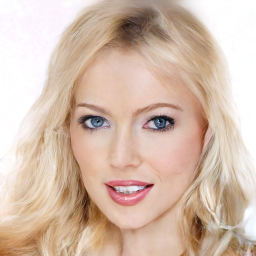
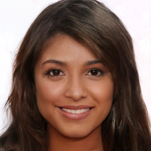
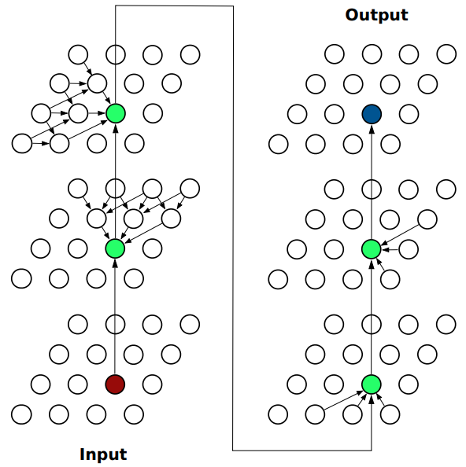

<h1>Spatial Dependency Networks: Neural Layers for Improved Generative Image Modeling</h1>

<div align="center">
  <a href="https://djordjemila.github.io/" target="_blank">Đorđe&nbsp;Miladinović</a> &emsp;
  <a href="https://astanic.github.io/" target="_blank">Aleksandar&nbsp;Stanić</a> &emsp;
  <a href="https://www.is.mpg.de/~sbauer" target="_blank">Stefan&nbsp;Bauer</a> &emsp;
  <a href="https://people.idsia.ch/~juergen/" target="_blank">Jürgen&nbsp;Schmidhuber</a> &emsp;
  <a href="https://inf.ethz.ch/people/person-detail.buhmann.html" target="_blank">Joachim&nbsp;M.&nbsp;Buhmann</a>
</div>
<br>
<br>

<div align="center">




</div>
<div align="center"> Example of SDN-VAE generated images. </div>


### Method Description

[Spatial dependency network (SDN)](https://openreview.net/forum?id=I4c4K9vBNny) is a novel neural architecture. It is based on spatial dependency layers which are designed for stacking deep neural networks that
produce images e.g. generative models such as VAEs or GANs or segmentation, super-resolution and image-to-image-translation neural networks.
SDNs improve upon celebrated CNNs by explicitly modeling spatial dependencies between feature vectors at each level of a deep neural network pipeline.
Spatial dependency layers (i) explicitly introduce the inductive bias of spatial coherence; and (ii) offer improved modeling of long-range dependencies 
due to the unbounded receptive field. We applied SDN to two variants of VAE, one which we used to model image density (SDN-VAE) and one which we used 
to learn better disentangled representations. More generally, spatial dependency layers can be used as a drop-in replacement for convolutional layers 
in any image-generation-related tasks.

<div align="center"></div>
<div align="center"> Graphical model of SDN layer. </div>

### Code Structure

    .
    ├── checkpoints/               # where the model checkpoints will be stored
    ├── data/
         ├── ImageNet32/           # where ImageNet32 data is stored
         ├── CelebAHQ256/          # where Celeb data is stored
         ├── 3DShapes/             # where 3DShapes data is stored
         ├── lmdb_datasets.py      # LMDB data loading borrowed from https://github.com/NVlabs/NVAE
         ├── get_dataset.py        # auxiliary script for fetching data sets
    ├── figs/                      # figures from the paper
    ├── lib/
         ├── DensityVAE            # SDN-VAE which we used for density estimation
         ├── DisentanglementVAE    # VAE which we used for disentanglement
         ├── nn.py                 # The script which contains SDN and other neural net modules
         ├── probability.py        # probability models
         ├── utils.py              # utility functions
     ├── train.py                  # generic training script
     ├── evaluate.py               # the script for evaluation of trained models
     ├── train_cifar.sh            # for reproducing CIFAR10 experiments
     ├── train_celeb.sh            # for reproducing CelebAHQ256 experiments
     ├── train_imagenet.sh         # for reproducing ImageNet32 experiments
     ├── train_3dshapes.sh         # for reproducing 3DShapes experiments
     ├── requirements.txt
     ├── LICENSE
     └── README.md

### Applying SDN to your neural network

To apply SDN to your framework it is sufficient that you integrate the 'lib/nn.py' file into your code.
You can then import and utilize SDNLayer or ResSDNLayer (the residual variant) in the same way convolutional layer is utilized.
Apart from [PyTorch](pytorch.org), no additional packages are required.

###### Tips & Tricks

If you would like to integrate SDN into your neural network, we recommend the following:

* first design and debug your framework using vanilla CNN layers.
* replace CNN layers one-by-one. Start with the lowest scale e.g. 4x4 or 8x8 to speed up debugging.
* start with 1 or 2 directions, and then later on try using 4 directions.
* larger number of features per SDN layers implies more expressive model which is more powerful but prone to overfitting.
* a good idea is to use smaller number of SDN features on smaller scales and larger on larger scales.

### Reproducing the experiments from the paper

Common to all experiments, you will need to install [PyTorch](pytorch.org) and [PyTorchLightning](https://github.com/PyTorchLightning/pytorch-lightning).
The default logging system is based on [Wandb](https://wandb.ai/site) but this can be changed in 'train.py'.
In case you decide to use Wandb, you will need to install it and then login into your account: Follow a very simple procedure described [here](https://docs.wandb.ai/examples).
To reproduce density estimation experiments you will need 8 TeslaV100 GPUs with 32Gb of memory.
One way to alleviate high memory requirements is to [accumulate gradient batches](https://pytorch-lightning.readthedocs.io/en/0.7.1/training_tricks.html), however, the training will take much longer in that case.
By default, you will need hardware that supports [automatic mixed precision](https://pytorch.org/tutorials/recipes/recipes/amp_recipe.html).
In case your hardware does not support this, you will need to reduce the batch size, however note that the results will slightly deteriorate and that you will possibly need to reduce the learning rate too to avoid NaN values.
For the disentanglement experiments, you will need a single GPU with >10Gb of memory.
To install all the requirements use:

``` bash
pip install -r requirements.txt
```

*Note of caution: Ensure the right version of PyTorchLightning is used. We found multiple issues in the newer versions as the library is not backward compatible.*


<details><summary>CIFAR10</summary>

The data will be automatically downloaded through PyTorch. To run the baselines that reproduce the results from the paper use:

```bash
bash train_cifar.sh
```
</details>

<details><summary>ImageNet32</summary>

To obtain the dataset go into the folder 'data/ImageNet32' and then run

```bash
bash get_imagenet_data.sh
```
To reproduce the experiments run:

``` bash
bash train_imagenet.sh
```
</details>

<details><summary>CelebAHQ256</summary>

To obtain the dataset go into the folder 'data/CelebAHQ256' and then run

``` bash
bash get_celeb_data.sh
```
The script is adapted from [NVAE repo](https://github.com/NVlabs/NVAE) and is based on [GLOW dataset](https://github.com/openai/glow).
To reproduce the experiments run:

``` bash
bash train_celeb.sh
```
</details>


<details><summary>3DShapes</summary>
Coming soon.
</details>


### Evaluation of pre-trained models

To perform post hoc evaluation of your pre-trained models, use 'evaluate.py' script and select flags corresponding to
the evaluation task and the model you want to use. The evaluation can be performed on a single GPU of any type, though 
note that the batch size needs to be modified dependent on the available GPU memory. For the CelebAHQ256 dataset, 
you can download the checkpoint which contains one of the pre-trained models that we used in the paper from [this link](https://drive.google.com/file/d/1wIQTHS5S_j9ixIQrKHmliPwgdLwG35WQ/view?usp=sharing). For example, you
can evaluate elbo and generate random samples by running:
``` python
python3 evaluate.py --model CelebAHQ256 --elbo --sampling
```

### Citation

Please cite our paper if you use our code or if you re-implement our method:

```
@inproceedings{
miladinovi{\'c}2021spatial,
title={Spatial Dependency Networks: Neural Layers for Improved Generative Image Modeling},
author={{\DJ}or{\dj}e Miladinovi{\'c} and Aleksandar Stani{\'c} and Stefan Bauer and J{\"u}rgen Schmidhuber and Joachim M. Buhmann},
booktitle={International Conference on Learning Representations},
year={2021},
url={https://openreview.net/forum?id=I4c4K9vBNny}
}
```
